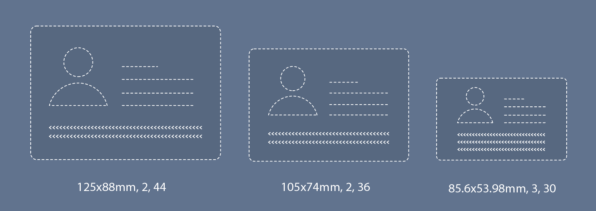

# Customizing the MRZ Scanner JavaScript Edition

> [!NOTE]
> Before customizing the MRZ Scanner, read the [MRZ Scanner User Guide]({{ site.guides }}mrz-scanner.html).

## Quick Links

- [Setting Available MRTD Formats](#setting-available-mrtd-formats)
- [Configuring Result Images](#configuring-result-images)
- [Using the `MRZScannerViewConfig`](#using-the-mrzscannerviewconfig)
- [Configuring the Scan Region](#configuring-the-scan-region)
- [Adjusting the Multi-Side Scanning Configuration](#adjusting-the-multi-side-scanning-configuration)
- [Adjusting the Multi-Frame Cross Filter](#adjusting-the-multi-frame-cross-filter)
- [Customizing Toolbar Buttons](#customizing-toolbar-buttons)
- [Customizing the Format Selector](#customizing-the-format-selector)
- [Customizing UI Messages](#customizing-ui-messages)
- [Customizing the Theme](#customizing-the-theme)
- [Reading Static Images and PDFs](#reading-static-images-and-pdfs)

## Introduction

This guide builds on the [MRZ Scanner User Guide]({{ site.guides }}mrz-scanner.html) by exploring the customization options available for the scanner UI and behavior. You'll work with two configuration interfaces:

- [**`MRZScannerConfig`**]({{ site.api }}mrz-scanner.html#mrzscannerconfig): top-level configuration passed to `new Dynamsoft.MRZScanner({ ... })`. Controls licensing, mount point, returned data, supported MRZ formats, and the engine resource paths.
- [**`MRZScannerViewConfig`**]({{ site.api }}mrz-scanner.html#mrzscannerviewconfig): nested under `MRZScannerConfig.scannerViewConfig`. Controls the `MRZScannerView` UI: visible elements, on-screen messages, toolbar buttons, theme, and the static-image upload flow.

Each example shows only the configuration changes needed. The `license` and `engineResourcePaths` fields (covered in the [User Guide]({{ site.guides }}mrz-scanner.html#step-2-initialize-the-scanner)) are omitted for brevity, but **both must be present on your real config** when installing via npm. Omitting `engineResourcePaths` causes a resource-initialization error at launch.

## `MRZScannerConfig` Overview

The [**`MRZScannerConfig`**]({{ site.api }}mrz-scanner.html#mrzscannerconfig) interface is passed to the constructor when creating an `MRZScanner` instance. It contains the following properties:

1. **`license`**: The license key. **Required**. If the license is undefined, invalid, or expired, the scanner displays an error and fails to launch. See the [License]({{ site.guides }}mrz-scanner.html#license) section of the User Guide to obtain a key.

2. **`container`**: A DOM element (or selector string) that holds the entire MRZ Scanner UI. When not specified, the scanner appends its own full-viewport container to `<body>`.

3. **`templateFilePath`**: Path to a custom Capture Vision template JSON file. The MRZ Scanner includes a default template; use this only when you have a custom template provided by Dynamsoft. Contact the [Dynamsoft Technical Support Team](https://www.dynamsoft.com/company/contact/) for assistance with template customization.

4. **`utilizedTemplateNames`**: A map of scan-mode → template-name overrides for the bundled template. Only needed in conjunction with `templateFilePath`.

5. **`engineResourcePaths`**: Locations of the DCV engine WebAssembly and data files. Required when installing via npm. See the [User Guide]({{ site.guides }}mrz-scanner.html#step-2-initialize-the-scanner) for the standard setup.

6. **`scannerViewConfig`**: Configuration for the `MRZScannerView`, which handles the live-camera scanning UI. See the [`MRZScannerViewConfig` Overview](#mrzscannerviewconfig-overview) below.

7. **`mrzFormatType`**: The set of MRTD formats the scanner will recognize. By default, all supported formats are enabled. See [Setting Available MRTD Formats](#setting-available-mrtd-formats) for the accepted values.

8. **`returnOriginalImage`** (default `false`): When `true`, includes the full unmodified frame on the result, retrievable via `result.getOriginalImage(side)`.

9. **`returnDocumentImage`** (default `true`): When `true`, includes a deskewed crop of the document on the result, retrievable via `result.getDocumentImage(side)`.

10. **`returnPortraitImage`** (default `true`): When `true`, includes a cropped portrait on the result, retrievable via `result.getPortraitImage()`. Also activates multi-side scanning. See [Adjusting the Multi-Side Scanning Configuration](#adjusting-the-multi-side-scanning-configuration) below.

The following sections cover the options most commonly customized at this level.

### Setting Available MRTD Formats

> [!TIP]
> Prerequisite: [Introduction to MRZ Formats]({{ site.introduction }}index.html#supported-mrz-formats)

The MRZ Scanner recognizes all five MRTD formats by default. To restrict it to a subset, pass an array of format strings via `mrzFormatType`:

```ts
const mrzScanner = new Dynamsoft.MRZScanner({
   license: "YOUR_LICENSE_KEY_HERE",
   mrzFormatType: ["td3_passport", "td1_id"], // passports and TD1 ID cards only
});
```

The accepted values are:

| Value | Document type |
| --- | --- |
| `"td3_passport"` | TD3-format passports |
| `"td1_id"` | TD1-format ID cards |
| `"td2_id"` | TD2-format ID cards (covers both standard TD2 and French national ID) |
| `"mrva_visa"` | Type-A machine-readable visas (TD3-sized) |
| `"mrvb_visa"` | Type-B machine-readable visas (TD2-sized) |

When the format selector is shown, only the buttons matching your `mrzFormatType` selection will appear. If only a single format is enabled, the selector hides itself entirely regardless of the `showFormatSelector` setting.

### Configuring Result Images

The result object returned by `launch()` exposes up to three kinds of images per scanned side: the **original** captured frame, a **deskewed document** crop, and the **portrait** crop. Each is opt-in or opt-out via a top-level config flag:

| Option | Type | Default | Effect |
| --- | --- | --- | --- |
| `returnOriginalImage` | `boolean` | `false` | Include the full unmodified frame. Retrieved via `result.getOriginalImage(side)`. |
| `returnDocumentImage` | `boolean` | `true` | Include a deskewed crop of the document. Retrieved via `result.getDocumentImage(side)`. |
| `returnPortraitImage` | `boolean` | `true` | Include a cropped portrait. Retrieved via `result.getPortraitImage()`. Also gates multi-side scanning. |

```ts
const mrzScanner = new Dynamsoft.MRZScanner({
   license: "YOUR_LICENSE_KEY_HERE",
   returnOriginalImage: true,   // include the raw frame
   returnDocumentImage: true,   // include the deskewed document crop (default)
   returnPortraitImage: false,  // skip the portrait crop and disable multi-side scanning
});
```

> [!NOTE]
> Setting `returnPortraitImage: false` disables multi-side scanning: the scanner stops after capturing the MRZ side and never prompts the user to flip the document. `result.getDocumentImage(Dynamsoft.EnumDocumentSide.Opposite)` and `result.getOriginalImage(Dynamsoft.EnumDocumentSide.Opposite)` will always return `null` in this case. See the [User Guide's Multi-Side Scanning section]({{ site.guides }}mrz-scanner.html#multi-side-scanning) for the full mechanics.

## `MRZScannerViewConfig` Overview

The [**`MRZScannerViewConfig`**]({{ site.api }}mrz-scanner.html#mrzscannerviewconfig) interface configures the `MRZScannerView`, which is the live-camera UI shown when `launch()` is called without a static image source. Pass it as `scannerViewConfig` on the `MRZScannerConfig`. Its properties:

1. **`uiPath`**: Path to a custom HTML user interface file for the `MRZScannerView`. The view is built on the Dynamsoft Camera Enhancer (DCE) UI; contact the [Dynamsoft Technical Support Team](https://www.dynamsoft.com/company/contact/) for assistance creating a custom UI file.

2. **`container`**: A DOM element (or selector string) that holds the `MRZScannerView`. When not specified, the scanner uses its own container.

3. **`enableScanRegion`** (default `true`): Show the rectangular scan guide frame at the centre of the camera view. When `false`, the scanner reads the entire camera frame instead of just the region inside the guide.

4. **`showLoadImageButton`** (default `true`): Show the gallery / load-image button in the toolbar. When enabled, users can scan an MRZ from an image file on their device without leaving the scanner view.

5. **`showFormatSelector`** (default `false`): Show the format selector underneath the scan guide frame. When enabled, users can toggle which MRZ formats are recognized at scan time. Only renders when more than one format is enabled via `mrzFormatType`.

6. **`showSoundToggle`** (default `true`): Show the sound toggle button. When enabled, users can turn the success-beep sound on or off. Browser support for audio feedback is required.

7. **`enableMultiFrameCrossFilter`** (default `true`): Enable the multi-frame result cross filter. Improves recognition accuracy at the cost of a small latency increase.

8. **`loadImageAcceptedTypes`** (default `"image/*"`): Value passed to the `<input type="file">` `accept` attribute when the user clicks the load-image button. Use this to broaden the file types accepted (e.g. PDFs).

9. **`loadImageFileConverter`**: Async callback that converts a non-image `File` (e.g. a PDF) into an image `Blob` before the scanner processes it. Required to support PDF uploads. See [Reading Static Images and PDFs](#reading-static-images-and-pdfs).

10. **`flipDocumentTimeout`** (default `3000`): Milliseconds to pause after the MRZ side is captured before portrait-side scanning begins, giving the user time to flip the document. Only takes effect during multi-side scanning.

11. **`toolbarButtonsConfig`**: Per-button overrides (icon, label, className, visibility) for the seven scanner toolbar buttons. See [Customizing Toolbar Buttons](#customizing-toolbar-buttons).

12. **`formatSelectorConfig`**: Labels for the format selector buttons. See [Customizing the Format Selector](#customizing-the-format-selector).

13. **`messagesConfig`**: Override every on-screen message in the scanner view. See [Customizing UI Messages](#customizing-ui-messages).

14. **`themeConfig`**: Override the scanner overlay's CSS color, typography, and spacing tokens. See [Customizing the Theme](#customizing-the-theme).

### Using the `MRZScannerViewConfig`

The visibility toggles, the multi-frame cross filter, and the load-image options are the most commonly tweaked properties. A representative configuration:

```ts
const mrzScanner = new Dynamsoft.MRZScanner({
   license: "YOUR_LICENSE_KEY_HERE",
   scannerViewConfig: {
      enableScanRegion: false,            // capture the entire camera frame, not just the guide region; default true
      showLoadImageButton: false,         // hide the gallery button in the toolbar; default true
      showFormatSelector: true,           // show the passport/ID/visa/all selector; default false
      showSoundToggle: false,             // hide the sound toggle button; default true
      showPoweredByDynamsoft: false,      // hide the attribution badge; default true
      enableMultiFrameCrossFilter: false, // disable cross-frame verification for faster (but less accurate) scans; default true

      loadImageAcceptedTypes: "image/*,application/pdf", // accept PDFs as well as images
      loadImageFileConverter: async (file) => {
         if (file.type === "application/pdf") {
            return await convertPdfToBlob(file); // your PDF-to-image helper
         }
         throw new Error("Unsupported file type");
      },
   },
});
```

The toolbar buttons, format selector labels, messages, and theme have their own dedicated configuration objects. See the subsections below.

### Configuring the Scan Region

The scan guide frame is the rectangular overlay at the centre of the camera view that helps the user position the document. When `enableScanRegion` is `true` (the default), the scanner only reads inside the frame, which improves both speed and accuracy.

<div align="center">
   
</div>

A single guide frame is used for all selected MRZ formats. The frame does not change shape based on the value of `mrzFormatType`.

There is one exception, which is part of the multi-side scanning flow: once the MRZ side has been captured and the scanner is waiting for the user to flip the document, the frame swaps to a portrait-oriented variant for the duration of the portrait-side capture. This is purely a visual cue indicating that the scanner is no longer looking for an MRZ. No configuration is required.

To hide the frame entirely (and have the scanner read the full camera frame), set `enableScanRegion: false`:

```ts
const mrzScanner = new Dynamsoft.MRZScanner({
   license: "YOUR_LICENSE_KEY_HERE",
   scannerViewConfig: {
      enableScanRegion: false,
   },
});
```

### Adjusting the Multi-Side Scanning Configuration

Multi-side scanning runs whenever `returnPortraitImage` is `true` (the default) and the portrait is not on the same side as the MRZ. After the MRZ side is captured, the scanner pauses for `flipDocumentTimeout` milliseconds, prompts the user to flip the card, and then captures the opposite side.

| Option | Type | Default | Purpose |
| --- | --- | --- | --- |
| `flipDocumentTimeout` | `number` (ms) | `3000` | Pause duration after the MRZ side is captured, giving the user time to flip the document before portrait-side scanning begins. |

```ts
const mrzScanner = new Dynamsoft.MRZScanner({
   license: "YOUR_LICENSE_KEY_HERE",
   returnPortraitImage: true, // default: multi-side scanning is enabled
   scannerViewConfig: {
      flipDocumentTimeout: 5000, // give the user 5 seconds instead of 3
   },
});
```

> [!TIP]
> For the full multi-side flow (which document types trigger it, what populates `EnumDocumentSide.Opposite`, and how to disable it entirely), see [Multi-Side Scanning]({{ site.guides }}mrz-scanner.html#multi-side-scanning) in the User Guide.

### Adjusting the Multi-Frame Cross Filter

By default, the scanner combines results across consecutive video frames before reporting a match, improving accuracy at the cost of a small latency increase. Set `enableMultiFrameCrossFilter: false` to report each frame's result independently. That's faster, but more susceptible to misreads on a noisy or poorly-lit feed.

```ts
const mrzScanner = new Dynamsoft.MRZScanner({
   license: "YOUR_LICENSE_KEY_HERE",
   scannerViewConfig: {
      enableMultiFrameCrossFilter: false,
   },
});
```

### Customizing Toolbar Buttons

The `toolbarButtonsConfig` field lets you override the icon, label, CSS class, or visibility of each toolbar button independently:

| Key | Button |
| --- | --- |
| `close` | Close the scanner |
| `loadImage` | Load an image file (gallery icon) |
| `cameraSwitch` | Switch between available cameras |
| `flash` | Turn the camera flash on |
| `flashOff` | Turn the camera flash off |
| `sound` | Turn the success-beep sound on |
| `soundOff` | Turn the success-beep sound off |

Each entry accepts the following fields, all optional:

| Field | Type | Purpose |
| --- | --- | --- |
| `icon` | `string` | Inline SVG markup or a URL to use as the button's icon. |
| `label` | `string` | Accessible label / tooltip text. |
| `className` | `string` | Additional CSS class added to the button element. |
| `isHidden` | `boolean` | When `true`, the button is not rendered. |

Example: rename the close button, hide the load-image button, restyle the camera switch, and replace the flash icons:

```ts
const mrzScanner = new Dynamsoft.MRZScanner({
   license: "YOUR_LICENSE_KEY_HERE",
   scannerViewConfig: {
      toolbarButtonsConfig: {
         close: { label: "Cancel" },
         loadImage: { isHidden: true },
         cameraSwitch: { className: "my-custom-camera-switch" },
         flash: { icon: "<svg>...</svg>" },
         flashOff: { icon: "<svg>...</svg>" },
      },
   },
});
```

> [!NOTE]
> The flash and flashOff buttons are still subject to device and browser support. Even if they are shown by configuration, they will only function on devices and browsers that expose the torch capability.

### Customizing the Format Selector

When `showFormatSelector` is `true`, the selector shows up to four buttons depending on which formats are enabled via `mrzFormatType`. Override the labels for localization or branding via `formatSelectorConfig`:

| Field | Default | Shown when… |
| --- | --- | --- |
| `passportLabel` | `"Passport"` | A passport format is enabled (`"td3_passport"`). |
| `idLabel` | `"ID"` | An ID-card format is enabled (`"td1_id"` or `"td2_id"`). |
| `visaLabel` | `"Visa"` | A visa format is enabled (`"mrva_visa"` or `"mrvb_visa"`). |
| `allLabel` | `"All"` | More than one format category is enabled. |

```ts
const mrzScanner = new Dynamsoft.MRZScanner({
   license: "YOUR_LICENSE_KEY_HERE",
   scannerViewConfig: {
      showFormatSelector: true,
      formatSelectorConfig: {
         passportLabel: "Passport",
         idLabel: "ID Card",
         visaLabel: "Visa",
         allLabel: "All",
      },
   },
});
```

### Customizing UI Messages

Every piece of on-screen text in the scanner view can be overridden via `messagesConfig`. The full list of keys and their default English values:

| Key | Default | When it appears |
| --- | --- | --- |
| `positionMRZ` | `"Position MRZ within the frame"` | Idle MRZ-side scanning prompt. |
| `holdSteady` | `"Hold steady..."` | Briefly shown when the scanner is locked onto a candidate. |
| `scanSuccess` | `"MRZ scanned ✓"` | Confirmation after the MRZ side is captured. |
| `flipDocument` | `"Now scan the portrait side"` | Prompt to flip the document during multi-side scanning. |
| `flipDocumentCountdown` | `"Flip and scan the other side ({seconds}s)"` | Countdown shown during `flipDocumentTimeout`. The `{seconds}` placeholder is replaced with the remaining seconds. |
| `positionPortrait` | `"Position portrait within the frame"` | Idle portrait-side scanning prompt. |
| `scanMRZFirst` | `"Scan the MRZ side first"` | Shown if a portrait is detected before the MRZ side is captured. |
| `scanningPortrait` | `"Scanning portrait..."` | Active portrait-side scanning. |
| `portraitScanned` | `"Portrait scanned ✓"` | Confirmation after the portrait side is captured. |
| `bothSidesScanned` | `"Both sides scanned ✓"` | Final confirmation when multi-side scanning completes. |
| `skipPortraitLabel` | `"Skip portrait scan"` | Label on the skip button that appears 5 seconds into the portrait-side phase. |
| `loadImageFailed` | `"Failed to load image"` | Error shown when an uploaded image cannot be processed. |
| `cameraAccessDenied` | `"Camera access denied"` | Error shown when the user blocks camera permission. |

Override only the messages you care about. Anything you leave out keeps its default:

```ts
const mrzScanner = new Dynamsoft.MRZScanner({
   license: "YOUR_LICENSE_KEY_HERE",
   scannerViewConfig: {
      messagesConfig: {
         positionMRZ: "Position the MRZ inside the frame",
         scanSuccess: "Scan complete",
         flipDocument: "Flip the document over",
         flipDocumentCountdown: "Flipping in {seconds}s...",
         cameraAccessDenied: "Please grant camera permission to continue",
      },
   },
});
```

> [!TIP]
> The `{seconds}` placeholder in `flipDocumentCountdown` is the only template placeholder. Every other message is rendered as plain text exactly as provided.

### Customizing the Theme

The scanner overlay reads its colors, typography, and spacing from a set of CSS custom properties. Override them via `themeConfig`, which is split into three groups:

- **`colors`**: palette tokens for the primary UI, accents, backgrounds, text, the guide frame, and the loading spinner.
- **`typography`**: font family and size tokens, with separate desktop overrides for the attribution badge and format buttons.
- **`spacing`**: top bar height, guide frame width, and badge margin / border-radius tokens, also with desktop variants.

Set only the tokens you want to override. Anything left out falls back to its default.

```ts
const mrzScanner = new Dynamsoft.MRZScanner({
   license: "YOUR_LICENSE_KEY_HERE",
   scannerViewConfig: {
      themeConfig: {
         colors: {
            primary: "#0066cc",
            accent: "#00aaff",
            backgroundDark: "#1a1a1a",
            text: "#ffffff",
            guideFrame: "#ffffff",
         },
         typography: {
            fontFamily: "'Inter', sans-serif",
            badgeFontSize: "14px",
         },
         spacing: {
            topBarHeight: "56px",
            guideFrameWidth: "85%",
         },
      },
   },
});
```

For the full list of color, typography, and spacing tokens, see the [`ThemeConfig` API reference]({{ site.api }}mrz-scanner.html#themeconfig).

### Reading Static Images and PDFs

The MRZ Scanner can also recognize MRZs from static image files and PDFs loaded via the in-scanner load-image button or your own file input. To enable file types beyond images (most commonly PDFs), set `loadImageAcceptedTypes` and provide a `loadImageFileConverter`:

```ts
const mrzScanner = new Dynamsoft.MRZScanner({
   license: "YOUR_LICENSE_KEY_HERE",
   scannerViewConfig: {
      loadImageAcceptedTypes: "image/*,application/pdf",
      loadImageFileConverter: async (file) => {
         if (file.type === "application/pdf") {
            return await convertPdfToBlob(file); // your PDF-to-image helper
         }
         throw new Error("Unsupported file type");
      },
   },
});
```

For a complete implementation, including a working PDF-to-image converter using PDF.js and an external file-input entry point, see [Setting up the MRZ Scanner for Static Images and PDFs]({{ site.guides }}mrz-scanner-static-image.html).

## Conclusion

The MRZ Scanner JavaScript Edition exposes a focused but expressive set of customization options across the two configuration interfaces, `MRZScannerConfig` and `MRZScannerViewConfig`. With these, you can:

- **Constrain the document formats** the scanner will recognize via `mrzFormatType`.
- **Control which images the result carries** via the `returnOriginalImage` / `returnDocumentImage` / `returnPortraitImage` flags, and implicitly toggle multi-side scanning.
- **Show or hide individual UI elements** of the scanner view (scan guide region, load-image button, format selector, sound toggle, attribution badge).
- **Tune the multi-side flip workflow** via `flipDocumentTimeout`.
- **Re-skin every toolbar button** (icon, label, class, visibility) via `toolbarButtonsConfig`.
- **Localize every on-screen message** via `messagesConfig`.
- **Restyle the overlay** with theme tokens for colors, typography, and spacing via `themeConfig`.
- **Accept additional file formats** (e.g. PDFs) via `loadImageAcceptedTypes` and `loadImageFileConverter`.

For customization needs not covered here, such as custom Capture Vision templates or fully custom DCE UI files, contact the [Dynamsoft Technical Support Team](https://www.dynamsoft.com/company/contact/).

For more on the MRZ Scanner JavaScript Edition, see:

- [MRZ Scanner User Guide]({{ site.guides }}mrz-scanner.html): production-ready integration walkthrough, multi-side scanning, and deployment.
- [Setting up the MRZ Scanner for Static Images and PDFs]({{ site.guides }}mrz-scanner-static-image.html): a complete file-input flow with PDF support.
- [API Reference]({{ site.api }}mrz-scanner.html): detailed reference for every configuration interface.
- [Introduction]({{ site.introduction }}index.html): overview of MRZ formats and capabilities.
