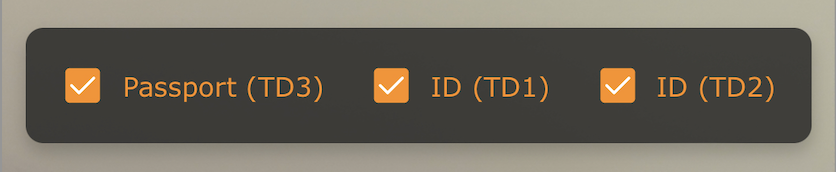

# Customizing the MRZ Scanner JavaScript Edition

> [!NOTE]
> Before customizing the MRZ Scanner, read the [MRZ Scanner User Guide]({{ site.guides }}mrz-scanner.html).

## Quick Links

- [Setting Available MRTD formats](#setting-available-mrtd-formats)
- [Hiding the Result View](#hiding-the-result-view)
- [Changing the Scan Guide Frame](#changing-the-scan-guide-frame)
- [Reading Static Images and PDFs using the MRZ Scanner](#reading-static-images-and-pdfs-using-the-mrz-scanner)
- [Configuring the `onDone` Callback](#configuring-the-ondone-callback)
- [Enable Result Editing](#enable-result-editing)

## Introduction

This guide builds on the [MRZ Scanner User Guide]({{ site.guides }}mrz-scanner.html) by exploring UI and performance customization options. You'll learn to use three main configuration interfaces:

- [**`MRZScannerConfig`**]({{ site.api }}mrz-scanner.html#mrzscannerconfig) - Main configuration
- [**`MRZScannerViewConfig`**]({{ site.api }}mrz-scanner.html#mrzscannerviewconfig) - Scanner view customization
- [**`MRZResultViewConfig`**]({{ site.api }}mrz-scanner.html#mrzresultviewconfig) - Result view customization

These interfaces make customization straightforward—simply add or modify properties in the constructor. Each example shows only the configuration changes needed, building on the Hello World sample.

## `MRZScannerConfig` Overview

The [**`MRZScannerConfig`**]({{ site.api }}mrz-scanner.html#mrzscannerconfig) interface configures most customization options for MRZ scanning. The MRZ Scanner passes an `MRZScannerConfig` object to the constructor when creating an instance. It contains the following properties:

1. **`license`** - The license key is the only property that **must be specified** when instantiating the MRZ Scanner. If the license is undefined, invalid, or expired, the scanner displays an error message instructing the user to contact the site administrator.

2. **`container`** - Pass a DOM element to contain the entire MRZ Scanner UI. When not specified (e.g., in the [Hello World sample]({{ site.codegallery }}helloworld/index.html)), the scanner automatically creates its own container.

3. **`templateFilePath`** - A template file is a JSON file containing algorithm parameter settings (called Capture Vision templates) for specialized scanning scenarios. The `templateFilePath` points to this file's location. The MRZ Scanner includes a default template, but you can use a custom template for specialized use cases. Contact the [Dynamsoft Technical Support Team](https://www.dynamsoft.com/company/contact/) for assistance with template customization. Host the custom template file on your server and use `templateFilePath` to specify its location.

4. **`utilizedTemplateNames`** - Define the names of Capture Vision templates in the custom template file specified by `templateFilePath`. These names must be declared when using a custom template.

5. **`engineResourcePaths`** - The engine files provide the core functionality and UI. This property defines the location of engine files when they're referenced from a different location. Typically used with frameworks like **React** or **Angular** when using package managers like **npm** or **yarn**.

6. **`scannerViewConfig`** - Configuration interface for the `MRZScannerView`, which handles the main scanning functionality and camera UI. See the [`MRZScannerViewConfig` overview](#mrzscannerviewconfig-overview) for details.

7. **`resultViewConfig`** - Configuration interface for the `MRZResultView`, which displays the scanned MRZ document and parsed data after a successful scan. See the [`MRZResultViewConfig` overview](#mrzresultviewconfig-overview) for details.

8. **`mrzFormatType`** - Configure the available MRTD formats for scanning. The formats set here appear in the format selector box within the `MRZScannerView`. By default, all supported MRTD formats are included. Learn more about supported formats in the [Introduction]({{ site.introduction }}index.html#supported-mrz-formats).

9. **`showResultView`** (default: `true`) - Toggle the visibility of the `MRZResultView`. When `false`, the scanner immediately closes after a successful scan and proceeds to your application's next workflow step. In the Hello World sample, this returns the user to the landing page.

The following sections show how to use these properties to customize the scanner.

### Setting Available MRTD formats

> [!TIP]
> Prerequisite: [Introduction to MRZ Formats]({{ site.introduction }}index.html#supported-mrz-formats)

The MRZ Scanner reads all three MRZ formats by default, but you can restrict which formats to recognize. For example, to scan only **TD1** and **TD3 (Passport)** documents while ignoring **TD2**:

```ts
const mrzScanner = new Dynamsoft.MRZScanner({
   license: "YOUR_LICENSE_KEY_HERE",
   mrzFormatType: ["passport", "td1"], // TD3 (passport) and TD1 only
});
```

The format selector box in the MRZScannerView will reflect your selection. If you specify only a single format, the selector box does not appear, even if `showFormatSelector` is set to `true`.

### Hiding the Result View

If your workflow doesn't require users to view or verify scanned results, you can hide the Result View and proceed directly to the next step:

```ts
const mrzScanner = new Dynamsoft.MRZScanner({
   license: "YOUR_LICENSE_KEY_HERE",
   showResultView: false,
});
```

## `MRZScannerViewConfig` Overview

[**`MRZScannerViewConfig`**]({{ site.api }}mrz-scanner.html#mrzscannerviewconfig) controls the UI elements of the `**MRZScannerView**`, which is the view responsible for scanning operations. Here are its properties in detail:

1. **`uiPath`** (formerly `cameraEnhancerUIPath`) - Specifies the path to a custom HTML user interface file for the `MRZScannerView`. The `MRZScannerView` is based on the Dynamsoft Camera Enhancer SDK UI. Contact the [Dynamsoft Technical Support Team](https://www.dynamsoft.com/company/contact/) for assistance creating custom UI files.

2. **`container`** - Assigns a specific DOM element to contain the `MRZScannerView`. When not specified, the MRZ Scanner automatically creates its own container.

3. **`showScanGuide`** (default: `true`) - Toggles the scan guide frame visibility. The scan guide frame is an overlay that helps users position their MRZ document correctly. When enabled, the scanner only reads within the frame boundaries, improving recognition speed and accuracy. Three frames are available, one for each MRTD format: TD3 (Passport), TD2 (ID), and TD1 (ID). See [Changing the Scan Guide Frame](#changing-the-scan-guide-frame) for details on how the frame changes based on selected formats.

    <div align="center">
       
    </div>

4. **`showUploadImage`** (default: `true`) - Toggles the file import icon in the `MRZScannerView` header. When enabled, users can scan MRZs from image files stored on their device. Set to `false` to hide this feature.

5. **`showFormatSelector`** (default: `true`) - Toggles the format selector box that appears near the bottom of the `MRZScannerView`. This selector allows users to enable or disable recognition of individual MRZ formats. Available formats are defined by the `mrzFormatType` property. At least one format must remain enabled. The scan guide frame updates based on selected formats (see [Changing the Scan Guide Frame](#changing-the-scan-guide-frame)).

    <div align="center">
       
    </div>

6. **`showSoundToggle`** (default: `true`) - Toggles the sound icon that appears in the `MRZScannerView` header. When enabled, users can control whether a beep plays after successfully recognizing an MRZ. This feature depends on browser support. Set to `false` to hide the sound toggle.

7. **`showPoweredByDynamsoft`** (default: `true`) - Toggles the "Powered By Dynamsoft" message at the bottom of the scanner UI. Set to `false` to hide this text.

8. **`enableMultiFrameCrossFilter`** (default: `true`) - Enables the multi-frame result cross filter, which improves recognition accuracy at the cost of slightly longer scan times.

9. **`uploadAcceptedTypes`** (default: `"image/*"`) - Specifies which image and file formats the scanner accepts when users upload static files instead of using the camera.

10. **`uploadFileConverter`** - A function that converts non-image files (e.g., PDFs) to blobs for processing by the MRZ Scanner. This function is required to support PDF file uploads.

> [!NOTE]
> The **torch/flash button** always appears in the `MRZScannerView` and cannot be hidden via configuration.

### Using the MRZScannerViewConfig

Here's an example showing the `MRZScannerViewConfig` properties in use:

```ts
const mrzScanner = new Dynamsoft.MRZScanner({
   license: "YOUR_LICENSE_KEY_HERE",
   scannerViewConfig: {
      showScanGuide: false, // hides the scan guide frame; true by default
      showUploadImage: false, // hides the load image icon that shows up in the toolbar at the top of the view; true by default
      showFormatSelector: false, // hides the format selector box if more than two MRZ types are assigned; true by default
      showSoundToggle: false, // hides the sound icon that allows the user to control whether a beep is played once an MRZ is recognized; true by default
      showPoweredByDynamsoft: false, // hides the "Powered By Dynamsoft" message that appears on the scanner UI; true by default
      enableMultiFrameCrossFilter: false, // turning the filter off could improve the speed but at the cost of result accuracy; true by default

      uploadAcceptedTypes: "image/*,application/pdf", // allows the user to upload static images and PDFs to be read by the MRZ Scanner - default is "image/*"
      uploadFileConverter: async (file) => {
         if (file.type === "application/pdf") {
            // Example PDF to image conversion
            const pdfData = await convertPDFToImage(file);
            return pdfData;
         }
        // For other non-image types, you can add more conversion logic
        // If it's not a supported type, throw an error
        throw new Error("Unsupported file type");
      },
   }
});
```

### Changing the Scan Guide Frame

The `MRZScannerView` provides a guide frame for each of the three MRTD formats. When the guide frame is enabled, the scanner only reads within its boundaries. The active guide frame depends on which formats are selected:

1. If **Passport** is selected, the **TD3 (Passport)** guide frame displays.

2. If both **ID (TD1)** and **ID (TD2)** are selected, or only **ID (TD1)** is selected (without Passport), the **TD1 (ID)** guide frame displays.

3. The **TD2 (ID)** guide frame only displays when **ID (TD2)** is the only selected format.

Contact the [Dynamsoft Support Team](https://www.dynamsoft.com/company/contact/) to customize the frame guide selection logic.

### Reading Static Images and PDFs using the MRZ Scanner

Starting with **v2.1**, the MRZ Scanner can read MRZs directly from static images and PDFs. Configure the `MRZScannerViewConfig` properties `uploadAcceptedTypes` and `uploadFileConverter` to enable this functionality, particularly for PDF support.

For a complete implementation guide, see [Using the MRZ Scanner with Static Images and PDFs]({{ site.guides }}mrz-scanner-static-image.html), which includes a full File Input sample.

## `MRZResultViewConfig` Overview

The `MRZResultView` displays parsed MRZ results and a cropped image of the MRTD document, eliminating the need to build a custom viewer. The [**`MRZResultViewConfig`**]({{ site.api }}mrz-scanner.html#mrzresultviewconfig) contains the following settings:

1. **`container`** - Assigns a specific DOM element to contain the `MRZResultView`. When not specified, the MRZ Scanner automatically creates its own container.

2. **`toolbarButtonsConfig`** - Configures the `MRZResultView` toolbar (located in the footer in portrait mode, on the right side in landscape). The toolbar includes a **re-take button** that returns to the `MRZScannerView` for a new scan (discarding the current result) and a **done button** that closes the scanner and destroys the `MRZScanner` instance. When scanning a static file instead of using the camera, a **cancel button** appears in place of the re-take button.

3. **`showOriginalImage`** (default: `true`) - Toggles the cropped document image at the top of the result view. Set to `false` to hide the image.

4. **`showMRZText`** (default: `true`) - Toggles the raw MRZ text field in the result view. Set to `false` to hide this field.

5. **`allowResultEditing`** (default: `false`) - Controls whether users can edit the parsed text fields. Enable this to allow users to correct parsed results that don't match the physical document. Combine with `showOriginalImage: true` to display the document image for cross-checking.

6. **`onDone`** - A callback function executed when the user clicks the *Done* button. This callback receives the `MRZResult` object (including the scanned image and parsed data) for processing after the scanner closes. See [Configuring the onDone Callback](#configuring-the-ondone-callback) for implementation details.

7. **`onCancel`** - A callback function executed when the user clicks the *Cancel* button (only appears when scanning a static file). By default, clicking cancel discards the result and returns to the landing page. Use this callback to define custom behavior. See the [**`MRZResultViewConfig`**]({{ site.api }}mrz-scanner.html#mrzresultviewconfig) API reference for implementation details.

### Using the `MRZResultViewConfig`

Here's an example showing the `MRZResultViewConfig` properties in use:

```ts
const mrzScanner = new Dynamsoft.MRZScanner({
   license: "YOUR_LICENSE_KEY_HERE",
   scannerViewConfig: {
      /* see the MRZScannerViewConfig section for details*/
   },
   resultViewConfig: {
      showOriginalImage: false, // hides the cropped image of the MRZ document in the result view; true by default
      allowResultEditing: true, // enables the ability to edit the result fields should the parsed information not match the MRZ document; false by default
      showMRZText: false, // hides the raw MRZ text as a result field in the result view; true by default
      toolbarButtonsConfig: {
         retake: {
            icon: "path to a png/svg file" // Changes the icon image of the retake button
            label: "Re-scan", // Change the text label of the retake button to the provided string; string is "Re-take" by default
            isHidden: true, // Hides the retake button; false by default
            className: "custom class name" // to implement a custom css to the done button, you can assign a custom css class to the button here
         },
         done: {
            icon: "path to a png/svg file" // Changes the icon image of the retake button
            label: "Return Home", // Change the text label of the done button to the provided string; string is "Done" by default
            isHidden: true, // Hides the done button; false by default
            className: "custom class name" // to implement a custom css to the done button, you can assign a custom css class to the button here
         }
      }
   }
});
```

### Configuring the `onDone` Callback

By default, clicking the *Done* button closes the scanner and returns to the landing page. The `onDone` callback in [**`MRZResultViewConfig`**]({{ site.api }}mrz-scanner.html#mrzresultviewconfig) lets you define custom behavior to integrate the scanner into your application workflow. The callback receives the `MRZResult` object containing all parsed data. For example:

```ts
const mrzScanner = new Dynamsoft.MRZScanner({
   license: "YOUR_LICENSE_KEY_HERE",
   scannerViewConfig: {
      /* see the MRZScannerViewConfig section to learn how to set this */
   },
   resultViewConfig: {
      onDone: (result) => {
         console.log(result.status.message); // print the result status message to the console
         console.log(result.status.code); // print the result status code
         console.log(result.data.firstName); // print the first name from the MRZ info
      }
   }
});
```

In this example, clicking *Done* prints the result status, status message, and first name to the console. The `MRZResult` object contains all parsed fields, the raw MRZ text, and the cropped document image. Access parsed fields using the `result.data.{fieldName}` pattern shown above.

### Enable Result Editing

In some cases, parsed fields may fail validation during the check digit verification step. The result editing feature allows users to manually correct these fields by comparing them against the physical document.

Enable this feature to let users verify and adjust parsed information when validation fails or when manual verification is required.

```ts
const mrzScanner = new Dynamsoft.MRZScanner({
   license: "YOUR_LICENSE_KEY_HERE",
   scannerViewConfig: {
      /* see the MRZScannerViewConfig section to learn how to set this */
   },
   resultViewConfig: {
      allowResultEditing: true,
   }
});
```

Setting `allowResultEditing: true` changes the result view UI to display editable fields. The screenshot below shows the difference:

<div align="center">
   
</div>

As you can see above, when result editing is enabled, the result fields will change into editable fields like in a form.

## Conclusion

The MRZ Scanner JavaScript Edition provides extensive customization options to fit your specific workflow requirements. Through the three main configuration interfaces—`MRZScannerConfig`, `MRZScannerViewConfig`, and `MRZResultViewConfig`—you can control virtually every aspect of the scanner's behavior and appearance.

Key customization capabilities include:

- **Format Control** - Restrict scanning to specific MRTD formats based on your use case
- **UI Customization** - Show or hide UI elements like the result view, scan guide, format selector, and toolbar buttons
- **File Input Support** - Enable scanning from static images and PDFs in addition to camera input
- **Result Handling** - Use the `onDone` callback to integrate scanned results into your application workflow
- **Result Editing** - Allow users to manually correct parsed fields when validation fails

These configuration options work together to create a seamless scanning experience tailored to your application's needs. For additional customization requirements or technical assistance, contact the [Dynamsoft Technical Support Team](https://www.dynamsoft.com/company/contact/).

For more information about the MRZ Scanner JavaScript Edition, explore these resources:

- [MRZ Scanner User Guide]({{ site.guides }}mrz-scanner.html) - Getting started with basic implementation
- [Using the MRZ Scanner with Static Images and PDFs]({{ site.guides }}mrz-scanner-static-image.html) - Complete guide for file input support
- [API Reference]({{ site.api }}mrz-scanner.html) - Detailed documentation for all configuration interfaces
- [Introduction]({{ site.introduction }}index.html) - Overview of MRZ formats and capabilities 