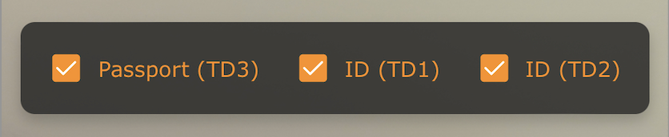

# User Guide for the MRZ Scanner JavaScript Edition

This user guide demonstrates how to build a web application that scans and parses MRZ (Machine Readable Zone) documents using the MRZ Scanner JavaScript Edition SDK. You'll learn to implement a complete scanning workflow from initialization to result handling, with practical examples you can adapt for your own application.

## License

### Trial License

Get started with a free 30-day trial license:



The trial license can be renewed twice via the [customer portal](https://www.dynamsoft.com/customer/license/trialLicense/?product=mrz&utm_source=guide&package=js) (15 days each renewal), giving you 60 days total for development and evaluation. Contact the [Dynamsoft Support Team](https://www.dynamsoft.com/company/contact/) if you need additional time or have questions.

> [!NOTE]
> The **MRZ Scanner** license includes licenses for **Dynamsoft Label Recognizer**, **Dynamsoft Code Parser**, and **Dynamsoft Camera Enhancer**, as the MRZ Scanner is built on these three products.

### Full License

If you are fully satisfied with the solution and would like to move forward with a full license, please contact the [Dynamsoft Sales Team](https://www.dynamsoft.com/company/contact/).

## Quick Start - Including the Library

> [!TIP]
> Visit the [Introduction]({{ site.introduction }}index.html) page to learn about MRZ document formats, the MRZ Scanner architecture, and system requirements.

This guide uses vanilla JavaScript to demonstrate the core concepts. The complete code is available in the [samples GitHub repo](https://github.com/Dynamsoft/mrz-scanner-javascript).

The first step is to include the SDK in your application. You can include the SDK using a precompiled script or build it from source.

<div class="multi-panel-switching-prefix"></div>

<div class="multi-panel-start"></div>
<div class="multi-panel-title">Use the Precompiled Script</div>

The simplest way to include the SDK is to use either the [**jsDelivr**](https://jsdelivr.com/) or [**UNPKG**](https://unpkg.com/) CDN. The Hello World sample that this guide will explore uses **jsDelivr**:

- jsDelivr

  ```html
  <script src="https://cdn.jsdelivr.net/npm/dynamsoft-mrz-scanner@3.1.0/dist/mrz-scanner.bundle.js"></script>
  ```

- UNPKG

  ```html
  <script src="https://unpkg.com/dynamsoft-mrz-scanner@3.1.0/dist/mrz-scanner.bundle.js"></script>
  ```

When using a framework such as **React**, **Vue** or **Angular**, we recommend adding the package as a dependency using a package manager such as **npm** or **yarn**:

  ```sh
  npm i dynamsoft-mrz-scanner@3.1.0 -E
  # or
  yarn add dynamsoft-mrz-scanner@3.1.0 -E
  ```

> [!WARNING]
> When using a package manager like **npm** or **yarn**, you likely need to specify the location of the engine files as a link to a CDN. Please see the [MRZScannerConfig API]({{ site.api }}mrz-scanner.html#mrzscannerconfig) for a code snippet on how to set the *engineResourcePaths*.

Below is the complete Hello World sample page that uses the precompiled script served via a CDN.

```html
<!DOCTYPE html>
<html lang="en">
  <head>
    <meta charset="utf-8" />
    <meta name="viewport" content="width=device-width, initial-scale=1.0" />
    <title>Dynamsoft MRZ Scanner - Hello World</title>
    <script src="https://cdn.jsdelivr.net/npm/dynamsoft-mrz-scanner@3.1.0/dist/mrz-scanner.bundle.js"></script>
  </head>

  <body>
    <h1 style="font-size: large">Dynamsoft MRZ Scanner</h1>

    <script>
      // Initialize the Dynamsoft MRZ Scanner
      const mrzScanner = new Dynamsoft.MRZScanner({
        license: "YOUR_LICENSE_KEY_HERE",
      });
      (async () => {
        // Launch the scanner and wait for the result
        const result = await mrzScanner.launch();
      })();
    </script>
  </body>
</html>
```

> [!NOTE]
> This is a simplified version of the Hello World file hosted on [GitHub](https://github.com/Dynamsoft/mrz-scanner-javascript/blob/main/samples/hello-world.html). The GitHub version includes additional UI enhancements, but they are not necessary to successfully launch the MRZ Scanner. Remember to replace `YOUR_LICENSE_KEY_HERE` with your own license key.

To run the sample, create a new file called `hello-world.html`, copy the code above into it, and serve it from a web server.

**For VS Code users**: The [Five Server extension](https://marketplace.visualstudio.com/items?itemName=yandeu.five-server) provides a quick way to serve the project. Install the extension, open `hello-world.html`, and click "Go Live" in the bottom right corner. This serves the application at `http://127.0.0.1:5500/hello-world.html`.

Alternatively, you can use other web servers like IIS or Apache.

<div class="multi-panel-end"></div>

<div class="multi-panel-start"></div>
<div class="multi-panel-title">Build from Source</div>

While the pre-compiled script is the easiest way to get started, you can also build the MRZ Scanner SDK from source for in-depth customization.

The MRZ Scanner is built using three Dynamsoft products: [**Dynamsoft Label Recognizer**]({{ site.dlr_js }}api-reference/label-recognizer-module.html?lang=javascript), [**Dynamsoft Code Parser**]({{ site.dcp_js }}api-reference/code-parser-module.html?lang=javascript), and [**Dynamsoft Camera Enhancer**]({{ site.dce_js }}api-reference/index.html?lang=javascript). Customizing the MRZ Scanner involves working with the foundational APIs of these products.

To build from source, you'll retrieve the source files from the official [GitHub repository](https://github.com/Dynamsoft/mrz-scanner-javascript), compile them into a distributable package, and run the included Hello World sample.

Follow these steps to build from source:

1. Download the source files from [GitHub](https://github.com/Dynamsoft/mrz-scanner-javascript) as a ZIP file (use the "Download ZIP" option).

2. Extract the contents of the ZIP file.

3. Open the Hello World sample at `/samples/hello-world.html` in your code editor.

4. Replace `YOUR_LICENSE_KEY_HERE` with your own license key.

5. Install project dependencies by navigating to the project root directory and running:
    ```bash
    npm install
    ```

6. Build the project:
    ```bash
    npm run build
    ```

7. Serve the project:
    ```bash
    npm run serve
    ```

Once the server is running, open your browser and navigate to the address shown in the terminal output.

<div class="multi-panel-end"></div>

<div class="multi-panel-start"></div>
<div class="multi-panel-title">Self-hosting the Library Resources</div>

For a **completely offline setup**, you can download the library resource files and host them on your own server, eliminating the need for external CDN dependencies.

### Acquiring the Resource Files

There are two ways to obtain the library resources:

- **From GitHub**: Download the [GitHub repository](https://github.com/Dynamsoft/mrz-scanner-javascript) as a ZIP file. The library resources are in the `dist` folder—simply copy this folder to your project.

- **From npm**: Install the package with `npm i dynamsoft-mrz-scanner@3.1.0 -E`, then locate the `dist` folder inside `node_modules/dynamsoft-mrz-scanner`.

### Modify the Build Script

Each framework has a different approach for copying resources locally during the build process. Below are configurations for Angular, React, and Vue:

#### Angular

Modify the `assets` section in **angular.json** to copy resources from `node_modules` to the `dist/my-app/browser/assets` folder:

```json
 "assets": [
  {
    "glob": "**/*",
    "input": "public"
  },
  {
    "glob": "**/*",
    "input": "node_modules/dynamsoft-mrz-scanner/dist",
    "output": "/assets/dynamsoft-mrz-scanner@3.1.0/dist"
  },
  {
    "glob": "**/*",
    "input": "node_modules/dynamsoft-capture-vision-bundle/dist",
    "output": "/assets/dynamsoft-capture-vision-bundle@3.2.5000/dist"
  },
  {
    "glob": "char-resources/**/*",
    "input": "node_modules/dynamsoft-capture-vision-data",
    "output": "/assets/dynamsoft-capture-vision-data@1.1.0"
  },
  {
    "glob": "models/**/*",
    "input": "node_modules/dynamsoft-capture-vision-data",
    "output": "/assets/dynamsoft-capture-vision-data@1.1.0"
  },
  {
    "glob": "parser-resources/**/*",
    "input": "node_modules/dynamsoft-capture-vision-data",
    "output": "/assets/dynamsoft-capture-vision-data@1.1.0"
  },
  {
    "glob": "templates/**/*",
    "input": "node_modules/dynamsoft-capture-vision-data",
    "output": "/assets/dynamsoft-capture-vision-data@1.1.0"
  },
  {
    "glob": "ui/**/*",
    "input": "node_modules/dynamsoft-capture-vision-data",
    "output": "/assets/dynamsoft-capture-vision-data@1.1.0"
  }
],
```

> [!NOTE]
> Ensure that `dynamsoft-mrz-scanner`, `dynamsoft-capture-vision-bundle`, and `dynamsoft-capture-vision-data` are installed via npm. The version numbers in the folder names (e.g., `@3.1.0`) should match your installed library versions.

#### React

Modify the `scripts` section in **package.json** to copy resources into the `public` folder:

```json
"scripts": {
  "copy-resources": "mkdir -p public/libs && cp -r node_modules/dynamsoft-mrz-scanner/ public/libs/dynamsoft-mrz-scanner@3.1.0/ && cp -r node_modules/dynamsoft-capture-vision-bundle/ public/libs/dynamsoft-capture-vision-bundle@3.2.5000/ && cp -r node_modules/dynamsoft-capture-vision-data public/libs/dynamsoft-capture-vision-data@1.1.0",
  "start": "react-scripts start",
  "build": "npm run copy-resources && react-scripts build",
  "test": "react-scripts test",
  "eject": "react-scripts eject"
},
```

> [!NOTE]
> The `copy-resources` script copies resources from `node_modules` to `public/libs` for runtime access. The `build` script runs `copy-resources` automatically. Version numbers should match your installed library versions.

Run `npm run build` to copy the resources and build your project.

#### Vue

Similar to React, modify the `scripts` section in **package.json**:

```json
"scripts": {
  "copy-resources": "mkdir -p public/libs && cp -r node_modules/dynamsoft-mrz-scanner/ public/libs/dynamsoft-mrz-scanner@3.1.0/ && cp -r node_modules/dynamsoft-capture-vision-bundle/ public/libs/dynamsoft-capture-vision-bundle@3.2.5000/ && cp -r node_modules/dynamsoft-capture-vision-data public/libs/dynamsoft-capture-vision-data@1.1.0",
  "serve": "vue-cli-service serve",
  "build": "npm run copy-resources && vue-cli-service build",
  "lint": "vue-cli-service lint"
},
```

> [!NOTE]
> The `copy-resources` script copies resources from `node_modules` to `public/libs` for runtime access. The `build` script runs `copy-resources` automatically. Version numbers should match your installed library versions.

### Update the Engine Resource Paths

After copying the resources locally, update the MRZ Scanner configuration to point to your self-hosted files instead of the CDN:

#### React / Vue

```ts
const mrzScanner = new Dynamsoft.MRZScanner({
    license: "YOUR_LICENSE_KEY_HERE",
    scannerViewConfig: {
      uiPath: "/libs/dynamsoft-mrz-scanner@3.1.0/dist/mrz-scanner.ui.html",
    },
    templateFilePath: "/libs/dynamsoft-mrz-scanner@3.1.0/dist/mrz-scanner.template.json",
    engineResourcePaths: {
      rootDirectory: "/libs/"
    }
});
```
> [!TIP]
> Please see [MRZScannerConfig API]({{ site.api }}mrz-scanner.html#mrzscannerconfig) for more info on the full configuration.


#### Angular

```ts
const config = {
  license: 'YOUR_LICENSE_KEY_HERE', // Replace with your Dynamsoft license key
  scannerViewConfig: {
    uiPath: "/assets/dynamsoft-mrz-scanner@3.1.0/dist/mrz-scanner.ui.html",
  },
  templateFilePath: "/assets/dynamsoft-mrz-scanner@3.1.0/dist/mrz-scanner.template.json",
  engineResourcePaths: {
      rootDirectory: "/assets/"
  }
};
```

### Server Requirements for Deployment

When deploying your self-hosted resources, ensure your server meets these requirements:

#### Secure Context (HTTPS Deployment)

Serve your application via a secure HTTPS connection for production. This is required because:

- **Camera Access**: Browsers only grant access to the camera video stream in a secure context.
- **License Validation**: The Dynamsoft License requires a secure context to function.

> [!NOTE]
> For development, some browsers (like Chrome) allow camera access on `http://127.0.0.1`, `http://localhost`, or `file:///` URLs.

#### Set MIME Type for `.wasm` Files

Configure your server to send the correct `Content-Type: application/wasm` header for WebAssembly files. Configuration varies by server:

- [Apache](https://developer.mozilla.org/en-US/docs/Learn/Server-side/Apache_Configuration_htaccess#media_types_and_character_encodings)
- [IIS](https://docs.microsoft.com/en-us/iis/configuration/system.webserver/staticcontent/mimemap)
- [NGINX](https://www.nginx.com/resources/wiki/start/topics/examples/full/#mime-types)

<div class="multi-panel-end"></div>

<div class="multi-panel-switching-end"></div>

## Understanding the Code

This section breaks down the Hello World sample to explain how each part works.

> [!NOTE]
> For framework-specific implementations (React, Angular, Vue), refer to the [framework samples]({{ site.codegallery }}index.html#frameworks).

### Step 1: Setting Up the HTML and Including the SDK

```html
<!DOCTYPE html>
<html lang="en">
  <head>
    <meta charset="utf-8" />
    <meta name="viewport" content="width=device-width, initial-scale=1.0" />
    <title>Dynamsoft MRZ Scanner - Hello World</title>
    <script src="https://cdn.jsdelivr.net/npm/dynamsoft-mrz-scanner@3.1.0/dist/mrz-scanner.bundle.js"></script>
  </head>

  <body>
    <h1 style="font-size: large">Dynamsoft MRZ Scanner</h1>
  </body>

</html>
```

The first step is to include the SDK in your HTML. As covered in the [Quick Start](#quick-start---including-the-library) section, this example uses the precompiled script from the jsDelivr CDN.

The MRZ Scanner includes a **Ready-to-Use UI** that automatically displays in a full-screen container when launched.

### Step 2: Initializing the MRZ Scanner

```html
<body>
  <h1 style="font-size: large">Dynamsoft MRZ Scanner</h1>

  <script>
    // Initialize the Dynamsoft MRZ Scanner
    const mrzScanner = new Dynamsoft.MRZScanner({
      license: "YOUR_LICENSE_KEY_HERE",
    });
  </script>
</body>
```

This is the simplest way to initialize the [**`MRZScanner`**]({{ site.api }}mrz-scanner.html#mrzscanner). The configuration object sets the behavior of the scanner instance. The only **required** property is the **license key**—without a valid license, the scanner will display an error and fail to launch. Refer to the [License](#license) section for instructions on obtaining a license key.

### Step 3: Launching the MRZ Scanner

```html
<script>
  // Initialize the Dynamsoft MRZ Scanner
  const mrzScanner = new Dynamsoft.MRZScanner({
    license: "YOUR_LICENSE_KEY_HERE",
  });
  (async () => {
    // Launch the scanner and wait for the result
    const result = await mrzScanner.launch();
    console.log(result);
  })();
</script>
```

Now that the [**`MRZScanner`**]({{ site.api }}mrz-scanner.html#mrzscanner) has been initialized, it's ready to launch. When `launch()` is called, this method:
- Opens the MRZ Scanner UI in a full screen container.
- Returns a Promise that resolves with the scanned [**`MRZResult`**](../api/mrz-scanner.md#mrzresult).
- Presents the user with a two-stage scanning workflow.

#### Scanning Workflow

When launched, the scanner guides the users through two main stages:

1. **Scanning Stage**: The `MRZScannerView` displays a camera interface for capturing MRZ documents.
2. **Review Stage**: The `MRZResultView` shows the scanned image and parsed data for user verification.

Let's explore each view in detail:

***MRZScannerView***

The `MRZScannerView` is configured using [**`MRZScannerViewConfig`**]({{ site.api }}mrz-scanner.html#mrzscannerviewconfig) and consists of these UI elements:

**Core Scanning Interface:**

1. **Camera View**: The camera viewfinder UI component that occupies the majority of the space, giving users a clear view and precise control of the image being scanned.

2. **Scan Guide Frame**: An overlay that guides users to position the MRZ document correctly for fast and accurate scanning. Enabled **by default**, and can be hidden via [**`MRZScannerViewConfig`**]({{ site.api }}mrz-scanner.html#mrzscannerviewconfig). When enabled, the scanner crops the region outside the guide frame.

    <div align="center">
       
    </div><br />

3. **Format Selector**: Allows users to choose which MRZ formats to recognize. Available formats are configured via [**`MRZScannerConfig`**]({{ site.api }}mrz-scanner.html#mrzscannerconfig), while visibility is controlled via [**`MRZScannerViewConfig`**]({{ site.api }}mrz-scanner.html#mrzscannerviewconfig). To learn about MRZ formats, refer to the [Introduction]({{ site.introduction }}index.html#supported-mrz-formats) page.

    <div align="center">
       
    </div><br />

**Camera Controls:**

4. **Resolution/Camera Select Dropdown**: Switch between available cameras or select different resolutions for the active camera.

5. **Flash Button**: Toggles the camera flash when available. Only appears if the device supports camera flash.

**Additional Options:**

6. **Load Image Button**: Scan an MRZ from an image file stored on the device.

7. **Sound Button**: Toggle audio feedback (beep) when an MRZ is recognized.

8. **Close Scanner Button**: Closes the MRZ Scanner and returns to the landing page.

> [!NOTE]
> To learn more about customizing the MRZScannerView and its UI elements, refer to the [Customization Guide]({{ site.guides }}mrz-scanner-customization.html).

***MRZResultView***

The `MRZResultView` is controlled by [**`MRZResultViewConfig`**]({{ site.api }}mrz-scanner.html#mrzresultviewconfig) and consists of these UI elements:

**Result Display:**

1. **Original Image**: The full, unmodified image of the scanned MRZ document, displayed at the top of the `MRZResultView`.

2. **Parsed Results**: The data extracted from the MRZ code, displayed below the original image with corresponding field names (e.g., Given Name, Nationality, Document Number). Users can edit field values to correct any recognition errors by cross-referencing with the document image above.

**Action Buttons:**

3. **Re-take Button**: Discards the current scan and returns to the `MRZScannerView` to capture another MRZ document.

4. **Done Button**: Closes the scanner, destroys the `MRZScanner` instance, and returns the result object containing the MRZ scan data. You can configure additional actions using the `onDone` callback, such as processing the result, navigating to another page, or performing further operations with the parsed data.

5. **Cancel Button**: Appears when scanning from a static file instead of the camera. Discards the result and returns to the landing page. Use the `onCancel` callback function in [**`MRZResultViewConfig`**]({{ site.api }}mrz-scanner.html#mrzresultviewconfig) to customize the behavior when this button is clicked.

> [!NOTE]
> In the Hello World sample, no action is taken once the Done button is clicked. The scanner closes and the user is met with an empty page. In order to open the scanner again, the user must refresh the page. You may choose to implement a more user-friendly behavior in a production environment, such as presenting the user with an option to re-open the MRZ Scanner upon closing it.

## Next Steps

Now that you have the basic MRZ Scanner functionality working, explore these advanced features:

- [Customizing the MRZ Scanner]({{ site.guides }}mrz-scanner-customization.html) - Learn how to customize the scanner UI and behavior to match your application's needs.
- [Setting up the MRZ Scanner for Static Images and PDFs]({{ site.guides }}mrz-scanner-static-image.html) - Enable scanning from image files and PDF documents.
