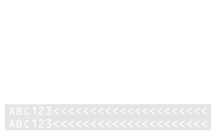
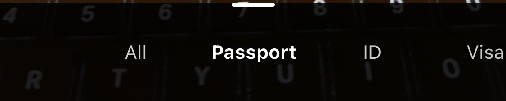

# User Guide for the MRZ Scanner JavaScript Edition

This user guide walks you through integrating the MRZ Scanner JavaScript Edition SDK into a production web application. You'll install the library via npm, self-host the SDK's runtime resources from your own origin, render the parsed MRZ data alongside the cropped document and portrait images, and deploy the application from your own server.

> [!TIP]
> If you want a single-file Hello World you can open from disk, see the [Quick Start]({{ site.guides }}mrz-scanner-quick-start.html) instead.

> [!IMPORTANT]
> Upgrading an existing **v3.x** integration rather than starting fresh? Work through the [Migration Guide (v3.x to v4.0)]({{ site.guides }}mrz-scanner-upgrade-guide.html) first, which covers the breaking changes in v4.0 with before/after code.

## License

### Trial License

Get started with a free 30-day trial license:



The trial license can be renewed twice via the [customer portal](https://www.dynamsoft.com/customer/license/trialLicense/?product=mrz&utm_source=guide&package=js) (15 days each renewal), giving you 60 days total. Contact the [Dynamsoft Support Team](https://www.dynamsoft.com/company/contact/) if you need more time.

> [!NOTE]
> The **MRZ Scanner** license includes licenses for **Dynamsoft Label Recognizer**, **Dynamsoft Code Parser**, and **Dynamsoft Camera Enhancer**, as the MRZ Scanner is built on these three products.

### Full License

For a full license, please contact the [Dynamsoft Sales Team](https://www.dynamsoft.com/company/contact/).

## Prerequisites

> [!TIP]
> Visit the [Introduction]({{ site.introduction }}index.html) page to learn about MRZ document formats, the MRZ Scanner architecture, and system requirements.

You'll need:

- **Node.js** `^24.0.0` and **npm** `^11.0.0` to install the package and run the development server.
- A **trial or full license key** (see [License](#license)).
- A modern browser with `getUserMedia` support for camera scanning.

## Including the Library

You can include the MRZ Scanner SDK in your application by installing it from npm or by building it from the source repository.

> [!TIP]
> Just looking for a quick implementation? The [Quick Start]({{ site.guides }}mrz-scanner-quick-start.html) loads the SDK from a CDN with a single `<script>` tag — no install steps required.

<div class="multi-panel-switching-prefix"></div>

<div class="multi-panel-start"></div>
<div class="multi-panel-title">Install via npm</div>

The recommended way to include the SDK is to install it as a project dependency:

```sh
npm i dynamsoft-mrz-scanner@4.0.0 -E
# or
yarn add dynamsoft-mrz-scanner@4.0.0 -E
```

This installs the MRZ Scanner package along with its two peer dependencies, **`dynamsoft-capture-vision-bundle`** and **`dynamsoft-capture-vision-data`**. Together they provide the JavaScript bundle, the WebAssembly engine, and the model and template data files that power MRZ recognition.

After installation, the layout under `node_modules/` looks like:

```
node_modules/
├── dynamsoft-mrz-scanner/              # the library bundle and UI/template assets
├── dynamsoft-capture-vision-bundle/    # DCV engine (JS + WASM)
└── dynamsoft-capture-vision-data/      # DCV model, template, and parser data
```

> [!IMPORTANT]
> The SDK's runtime resources (UI templates, WebAssembly engine, model data) live inside `node_modules/`, which isn't served to the browser. Before launching the scanner you need to do two things: copy the three Dynamsoft folders into a `public/` directory served at the same origin as your page, and set `engineResourcePaths` on the scanner config to point at the staged `dcvBundle` and `dcvData` locations. Skipping `engineResourcePaths` when installing via npm causes a resource-initialization error at launch. The next section covers both steps. See [Resource Hosting](#resource-hosting) for deployment variants.

<div class="multi-panel-end"></div>

<div class="multi-panel-start"></div>
<div class="multi-panel-title">Build from Source</div>

For deeper customization or to track the latest changes, you can build the SDK from the source repository.

The MRZ Scanner is built on three Dynamsoft products: [**Dynamsoft Label Recognizer**]({{ site.dlr_js }}api-reference/label-recognizer-module.html?lang=javascript), [**Dynamsoft Code Parser**]({{ site.dcp_js }}api-reference/code-parser-module.html?lang=javascript), and [**Dynamsoft Camera Enhancer**]({{ site.dce_js }}api-reference/index.html?lang=javascript). Building from source gives you direct access to the views and helpers that wire those products together.

Follow these steps:

1. Clone the [GitHub repository](https://github.com/Dynamsoft/mrz-scanner-javascript) (or download a ZIP and extract it).

2. From the project root, install dependencies:

    ```bash
    npm install
    ```

3. Build the library bundles:

    ```bash
    npm run build
    ```

    This produces the `dist/` folder containing everything you need to include in your own application: `dist/mrz-scanner.mjs` (ESM), `dist/mrz-scanner.cjs` (CommonJS), `dist/mrz-scanner.bundle.js` (IIFE), and the type declarations in `dist/mrz-scanner.d.ts`. Reference these directly from your project or publish them to your own registry.

4. **(Optional)** To try out the samples that ship with the repository, start the bundled Vite dev server:

    ```bash
    npm run dev
    ```

    The dev server serves the `samples/` folder over HTTPS with a self-signed certificate, using the `dist/` you just built in step 3. Open the URL printed in the terminal output and navigate to a sample (for example, `samples/demo/index.html`).

<div class="multi-panel-end"></div>

<div class="multi-panel-switching-end"></div>

## Building a Production Sample

This section walks you through standing up the MRZ Scanner against an npm install with the SDK's runtime resources hosted from your own origin. The scanner opens full-screen, recognizes an MRZ, and renders the parsed data and cropped images onto the page.

This walkthrough assumes you've installed the SDK via npm in a project at `mrz-scanner-app/` and that the page is served from the project root. Adapt the paths to match your project layout.

If you don't already have a project set up, create one now:

```bash
mkdir mrz-scanner-app
cd mrz-scanner-app
npm init -y
npm i dynamsoft-mrz-scanner@4.0.0 -E
```

This installs the SDK and its two peer dependencies under `node_modules/`. Next, create a `public/` directory and copy the three Dynamsoft folders into it. At runtime the bundler (or any static server pointed at the project) serves `public/` at `/`, which is exactly where the SDK looks for its UI/template assets and the DCV engine resources:

```bash
# macOS / Linux
mkdir public
cp -R node_modules/dynamsoft-mrz-scanner \
      node_modules/dynamsoft-capture-vision-bundle \
      node_modules/dynamsoft-capture-vision-data public/
```

```powershell
# Windows PowerShell
New-Item -ItemType Directory public
Copy-Item -Recurse `
  node_modules/dynamsoft-mrz-scanner, `
  node_modules/dynamsoft-capture-vision-bundle, `
  node_modules/dynamsoft-capture-vision-data public/
```

The layout afterwards:

```
mrz-scanner-app/
├── node_modules/                          # still here — your dev server reads from it
├── public/
│   ├── dynamsoft-mrz-scanner/             # ← copied, served at /dynamsoft-mrz-scanner/
│   ├── dynamsoft-capture-vision-bundle/   # ← copied
│   └── dynamsoft-capture-vision-data/     # ← copied
└── package.json
```

Re-run the copy after every `npm install` that bumps the SDK or DCV (or script it into your build).

### Step 1: Set Up the App Structure

Create a file named `index.html` at the project root. It loads the SDK from the `dynamsoft-mrz-scanner/` folder you staged in `public/` and provides a single `<div>` for the scan result:

```html
<!doctype html>
<html lang="en">
  <head>
    <meta charset="utf-8" />
    <meta name="viewport" content="width=device-width, initial-scale=1.0" />
    <title>Dynamsoft MRZ Scanner</title>
    <script src="/dynamsoft-mrz-scanner/dist/mrz-scanner.bundle.js"></script>
  </head>

  <body>
    <h1>Dynamsoft MRZ Scanner</h1>
    <div id="results"></div>

    <script type="module">
      // The application code from the next steps goes here.
    </script>
  </body>
</html>
```

Once `mrz-scanner.bundle.js` is loaded, it exposes a global `Dynamsoft` namespace that holds the `MRZScanner` constructor, the `EnumDocumentSide` enum, and other helpers used below. The MRZ Scanner ships with a **Ready-to-Use UI**, so no scanner container element is required — once launched, the scanner takes over the page.

### Step 2: Initialize the Scanner

Inside the `<script type="module">` block, grab a reference to the results container and create the scanner instance:

```js
const results = document.querySelector("#results");

const mrzscanner = new Dynamsoft.MRZScanner({
  license: "YOUR_LICENSE_KEY_HERE",
  engineResourcePaths: {
    dcvBundle: "/dynamsoft-capture-vision-bundle/dist/",
    dcvData: "/dynamsoft-capture-vision-data/",
  },
});
```

What's going on here:

- **`license`** — replace `YOUR_LICENSE_KEY_HERE` with your trial or full key (see [License](#license)). An invalid license causes a launch error.
- **`engineResourcePaths`** — tells the SDK where to find the DCV engine bundle and model data files. These paths are **required** when installing via npm. The values above match the `public/` layout staged in the previous section, where the bundle lives at `/dynamsoft-capture-vision-bundle/dist/` and the data files live at `/dynamsoft-capture-vision-data/`. If you host the assets from a different path or CDN, see [Resource Hosting](#resource-hosting).

> [!WARNING]
> Omitting `engineResourcePaths` when the SDK is installed via npm causes a resource-initialization error at launch. The SDK has no built-in default that points at a local `public/` directory, so it must be told where to look. The CDN distribution covered in the [Quick Start]({{ site.guides }}mrz-scanner-quick-start.html) is the only setup where `engineResourcePaths` can be omitted.

For the full list of configuration options, see the [MRZScannerConfig API]({{ site.api }}mrz-scanner.html#mrzscannerconfig).

### Step 3: Launch the Scanner and Render the Result

Below the constructor, `await` `launch()` and use the result to populate the `#results` div:

```js
const result = await mrzscanner.launch();
if (!result?.data) {
  results.textContent = "No MRZ scanned. Please try again.";
} else {
  const mrzSide = result.getDocumentImage(Dynamsoft.EnumDocumentSide.MRZ);
  const portraitSide = result.getDocumentImage(Dynamsoft.EnumDocumentSide.Opposite);
  const portrait = result.getPortraitImage();
  if (portraitSide?.toCanvas) results.appendChild(portraitSide.toCanvas());
  if (mrzSide?.toCanvas) results.appendChild(mrzSide.toCanvas());
  if (portrait?.toCanvas) results.appendChild(portrait.toCanvas());

  const pre = document.createElement("pre");
  pre.textContent = JSON.stringify(result.data, null, 2);
  results.appendChild(pre);
}
```

`launch()` opens the **MRZScannerView**, a full-screen container with a live camera feed, a guide frame, format selector, and toolbar buttons (including a built-in **Load Image** button for scanning a file instead of using the camera). When an MRZ is recognized, the promise resolves with an [**`MRZResult`**]({{ site.api }}mrz-scanner.html#mrzresult). When the user cancels or no MRZ is detected, the promise still resolves but with `result.data` undefined, which the `if` branch handles by surfacing a short message.

Key APIs in use:

- **`result.data`** — the parsed MRZ payload: `firstName`, `lastName`, `sex`, `age`, `nationality`, `documentType`, `documentNumber`, `issuingState`, `dateOfBirth`, `dateOfExpiry`, `mrzText`, and `optionalData1` / `optionalData2` when present. Dates are returned as `{ year, month, day }` objects.
- **`result.getDocumentImage(side)`** — deskewed crop of the document for the given side. `Dynamsoft.EnumDocumentSide.MRZ` is the side carrying the MRZ; `EnumDocumentSide.Opposite` is the opposite side, populated only when multi-side scanning runs (see [Multi-Side Scanning](#multi-side-scanning)).
- **`result.getOriginalImage(side)`** — the full unmodified frame for the given side. Only populated when `returnOriginalImage: true` is passed to the constructor (it defaults to `false`).
- **`result.getPortraitImage()`** — the portrait crop, regardless of which side it was found on.
- **`DSImageData.toCanvas()`** — converts the image into an `HTMLCanvasElement` ready to append to the DOM. `toBlob()` is also available if you'd rather upload or store the image.

For a human-readable label table instead of raw JSON, iterate `result.data` and look up each key in `Dynamsoft.MRZDataLabel` (e.g. `documentNumber` → `"Document Number"`).

### Putting It All Together

The full `index.html` after all three steps:

```html
<!doctype html>
<html lang="en">
  <head>
    <meta charset="utf-8" />
    <meta name="viewport" content="width=device-width, initial-scale=1.0" />
    <title>Dynamsoft MRZ Scanner</title>
    <script src="/dynamsoft-mrz-scanner/dist/mrz-scanner.bundle.js"></script>
  </head>

  <body>
    <h1>Dynamsoft MRZ Scanner</h1>
    <div id="results"></div>

    <script type="module">
      const results = document.querySelector("#results");

      const mrzscanner = new Dynamsoft.MRZScanner({
        license: "YOUR_LICENSE_KEY_HERE",
        engineResourcePaths: {
          dcvBundle: "/dynamsoft-capture-vision-bundle/dist/",
          dcvData: "/dynamsoft-capture-vision-data/",
        },
      });

      const result = await mrzscanner.launch();
      if (!result?.data) {
        results.textContent = "No MRZ scanned. Please try again.";
      } else {
        const mrzSide = result.getDocumentImage(Dynamsoft.EnumDocumentSide.MRZ);
        const portraitSide = result.getDocumentImage(Dynamsoft.EnumDocumentSide.Opposite);
        const portrait = result.getPortraitImage();
        if (portraitSide?.toCanvas) results.appendChild(portraitSide.toCanvas());
        if (mrzSide?.toCanvas) results.appendChild(mrzSide.toCanvas());
        if (portrait?.toCanvas) results.appendChild(portrait.toCanvas());

        const pre = document.createElement("pre");
        pre.textContent = JSON.stringify(result.data, null, 2);
        results.appendChild(pre);
      }
    </script>
  </body>
</html>
```

Drop in your license key, serve the file (see [Local HTTPS via Vite](#local-https-via-vite) for a one-command dev server), and you have a working integration.

> [!TIP]
> The result view above is intentionally bare-bones: three appended canvases and a raw JSON dump, with no CSS applied. For a fully styled sample similar to the online demo, see the [MRZ Scanner Demo]({{ site.codegallery }}demo/index.html) under Code Gallery.

## Multi-Side Scanning

Multi-side scanning is what produces a populated `EnumDocumentSide.Opposite` image on the result. It is **on by default** because `returnPortraitImage` defaults to `true`; setting `returnPortraitImage: false` disables it and `getDocumentImage(Opposite)` / `getOriginalImage(Opposite)` will always return `null`.

The flow when multi-side scanning is enabled:

1. The user scans the **MRZ side**. This populates the primary images returned by `getOriginalImage(MRZ)` and `getDocumentImage(MRZ)`.
2. The scanner inspects the same side for a portrait. If it finds one (e.g. a passport, where the MRZ and the portrait are on the same photo page), the portrait crop fills `getPortraitImage()` and the scan ends. **`EnumDocumentSide.Opposite` stays `null`.**
3. If no portrait is found on the MRZ side (typical for TD1 / TD2 ID cards, where the portrait sits on the side opposite the MRZ), the UI prompts the user to flip the document after `flipDocumentTimeout` milliseconds (default `3000`), captures the other side, and populates `getOriginalImage(Opposite)` and `getDocumentImage(Opposite)` along with the portrait crop.

The API uses **`MRZ`** and **`Opposite`** rather than front/back because document layouts vary by country, and there's no guarantee the MRZ is on the physical back or that the portrait is on the physical front. The scanner always captures the **MRZ side first** and labels it `MRZ`; whichever side the user flips to is labeled `Opposite`.

In practice:

| Document type | `getDocumentImage(MRZ)` | `getDocumentImage(Opposite)` | `getPortraitImage()` |
| --- | --- | --- | --- |
| Passports (TD3) | populated | `null` | populated (from the same side) |
| ID cards (TD1 / TD2) | populated | populated | populated (from the `Opposite` side) |
| Any document, with `returnPortraitImage: false` | populated | `null` | `null` |

The same matrix applies to `getOriginalImage(side)` when `returnOriginalImage: true`.

To customize the flip-document countdown duration, set `scannerViewConfig.flipDocumentTimeout` on the `MRZScannerConfig`. See the [Customization Guide]({{ site.guides }}mrz-scanner-customization.html) for the full list of multi-side-scanning options.

## Lifecycle and Disposal

`MRZScanner` instances are stateful and hold references to the camera, the WebAssembly engine, and DOM containers. The SDK manages most of this for you:

- **`launch()` always disposes when it resolves.** On success, failure, or cancellation, the camera, CV router, and DOM containers are torn down and the instance is marked uninitialized.
- **`launch()` is re-entrant.** Calling `launch()` again on the same instance re-initializes from scratch — useful for a re-scan flow.
- **Configuration is fixed at construction time.** To change `license`, `mrzFormatType`, the `return*Image` flags, `engineResourcePaths`, or `scannerViewConfig`, construct a new `MRZScanner` instance.
- **`dispose()` is idempotent and only needs to be called explicitly** when tearing down without launching again — for example, on SPA component unmount.

## Understanding the MRZScannerView

When `launch()` is called without an image source, the MRZ Scanner opens the **MRZScannerView** in a full-screen container. The view is configured via [**`MRZScannerViewConfig`**]({{ site.api }}mrz-scanner.html#mrzscannerviewconfig), which is nested under the `scannerViewConfig` field of `MRZScannerConfig`.

The view consists of these UI elements:

**Core Scanning Interface:**

1. **Camera View** — the camera viewfinder, occupying most of the screen.

2. **Scan Guide Frame** — an overlay that guides the user to position the MRZ document correctly for fast and accurate scanning. Enabled **by default**, and can be disabled via `MRZScannerViewConfig.enableScanRegion`. When enabled, the scanner reads only the region inside the guide frame; when disabled, the entire camera frame is read.

    <div align="center">
       
    </div><br />

3. **Format Selector** — allows the user to choose which MRZ formats to recognize. Available formats are configured via `MRZScannerConfig.mrzFormatType`, while visibility is controlled via `MRZScannerViewConfig.showFormatSelector`. To learn about MRZ formats, see the [Introduction]({{ site.introduction }}index.html#supported-mrz-formats) page.

    <div align="center">
       
    </div><br />

**Camera Controls:**

4. **Resolution / Camera Select Dropdown** — switch between available cameras or select different resolutions for the active camera.

5. **Flash Button** — toggles the camera flash when available. Only appears if the device and browser support camera flash.

**Additional Options:**

6. **Load Image Button** — scan an MRZ from an image file stored on the device. This button is part of the scanner UI and works inside an active camera session as an alternative to capturing from the live feed.

7. **Sound Button** — toggle audio feedback (beep) when an MRZ is recognized.

8. **Close Scanner Button** — closes the MRZ Scanner. The `launch()` promise resolves with no `data`, which your result-rendering code should treat as a cancellation.

> [!NOTE]
> To learn more about customizing the MRZScannerView and its UI elements — toolbar buttons, theme, on-screen messages, format selector labels, the multi-side scanning timeout, and more — see the [Customization Guide]({{ site.guides }}mrz-scanner-customization.html).

## Local HTTPS via Vite

The MRZ Scanner needs a secure context (HTTPS) for camera access and license validation. For development (especially when testing on a phone over the LAN), Vite combined with the [`@vitejs/plugin-basic-ssl`](https://www.npmjs.com/package/@vitejs/plugin-basic-ssl) plugin produces a self-signed certificate on the fly with no server setup.

Install Vite and the plugin in your project:

```bash
npm i -D vite @vitejs/plugin-basic-ssl
```

Create a `vite.config.ts` (or `vite.config.js`) at your project root:

```ts
import { defineConfig } from "vite";
import basicSsl from "@vitejs/plugin-basic-ssl";

export default defineConfig({
  plugins: [basicSsl()],
  server: {
    host: "0.0.0.0",
    headers: {
      // Enable SharedArrayBuffer so DCV can use the multi-threaded (pthread)
      // WASM variant for better performance.
      "Cross-Origin-Opener-Policy": "same-origin",
      "Cross-Origin-Embedder-Policy": "require-corp",
    },
  },
});
```

Then run:

```bash
npx vite
```

Vite prints a `https://localhost:<port>` URL plus the LAN-accessible URL bound by `host: "0.0.0.0"`. Open the page, accept the self-signed certificate warning, and grant camera permission. The MRZ Scanner UI launches over HTTPS.

> [!NOTE]
> The COOP and COEP headers are not strictly required, but they enable `SharedArrayBuffer`, which lets the DCV engine load the multi-threaded WebAssembly variant for noticeably faster MRZ recognition. If your application embeds third-party content that doesn't set the matching `Cross-Origin-Resource-Policy` header, omit the COOP/COEP block.

> [!WARNING]
> Self-signed certificates trigger a "Your connection is not private" warning on first visit. Click **Advanced** → **Proceed to localhost (unsafe)** to continue. Browsers do not persist this exception across full reinstalls or profile resets.

When you're ready to ship the application to a real server, see [Deployment](#deployment) below for the production hosting requirements.

## Deployment

When you're ready to ship your application to a production server, note that the MRZ Scanner is a static web SDK. Any server capable of serving HTML, JavaScript, WebAssembly, and JSON files works. The requirements below apply to that production server. For local development over HTTPS, see [Local HTTPS via Vite](#local-https-via-vite) above.

### Secure Context (HTTPS)

Serve your application over HTTPS in production. This is required because:

- **Camera Access** — browsers only grant access to the camera video stream in a secure context.
- **License Validation** — the Dynamsoft License requires a secure context to function.

> [!NOTE]
> For development, some browsers (like Chrome) allow camera access on `http://127.0.0.1`, `http://localhost`, or `file:///` URLs as a developer convenience.

### MIME Type for `.wasm` Files

Configure your server to send the correct `Content-Type: application/wasm` header for WebAssembly files. Configuration varies by server:

- [Apache](https://developer.mozilla.org/en-US/docs/Learn/Server-side/Apache_Configuration_htaccess#media_types_and_character_encodings)
- [IIS](https://docs.microsoft.com/en-us/iis/configuration/system.webserver/staticcontent/mimemap)
- [NGINX](https://www.nginx.com/resources/wiki/start/topics/examples/full/#mime-types)

### Resource Hosting

At build time, stage the three Dynamsoft folders (`dynamsoft-mrz-scanner/`, `dynamsoft-capture-vision-bundle/`, and `dynamsoft-capture-vision-data/`) into your project's `public/` directory so they're served at the same origin as your HTML, at `/`. On your scanner config, `engineResourcePaths.dcvBundle` and `engineResourcePaths.dcvData` must point at the staged locations. The values shown in [Step 2](#step-2-initialize-the-scanner) above match this layout.

If you serve the folders from a different path or origin (a CDN under `/static/dynamsoft/`, for example), update `engineResourcePaths` to point at the actual locations:

```js
new Dynamsoft.MRZScanner({
  license: "YOUR_LICENSE_KEY_HERE",
  engineResourcePaths: {
    dcvBundle: "https://cdn.example.com/static/dynamsoft/dynamsoft-capture-vision-bundle/dist/",
    dcvData:   "https://cdn.example.com/static/dynamsoft/dynamsoft-capture-vision-data/",
  },
});
```

## Next Steps

- [Customizing the MRZ Scanner]({{ site.guides }}mrz-scanner-customization.html) — tailor the scanner UI, toolbar buttons, theme, on-screen messages, and multi-side scanning behavior.
- [Setting up the MRZ Scanner for Static Images and PDFs]({{ site.guides }}mrz-scanner-static-image.html) — process image and PDF files as input instead of (or in addition to) the live camera feed.
- For framework-specific implementations (React, Angular, Vue), see the [framework samples]({{ site.codegallery }}index.html#frameworks).
